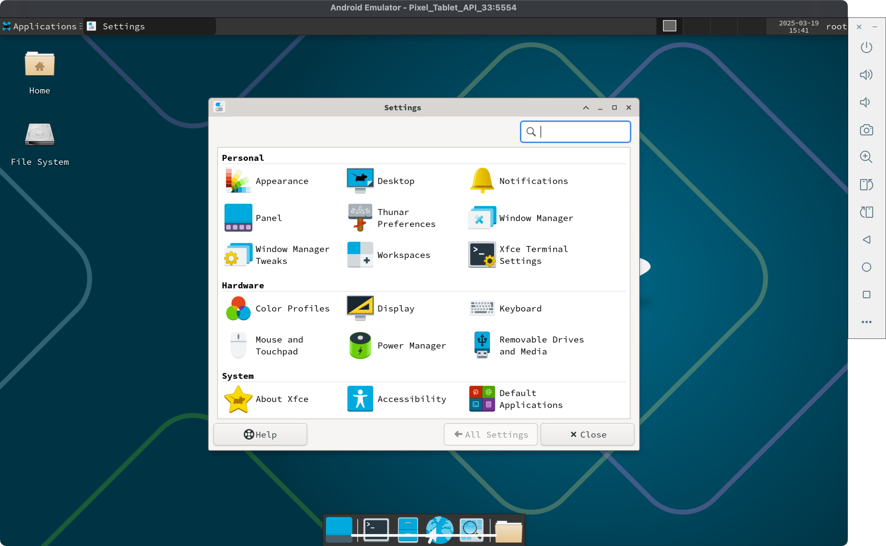
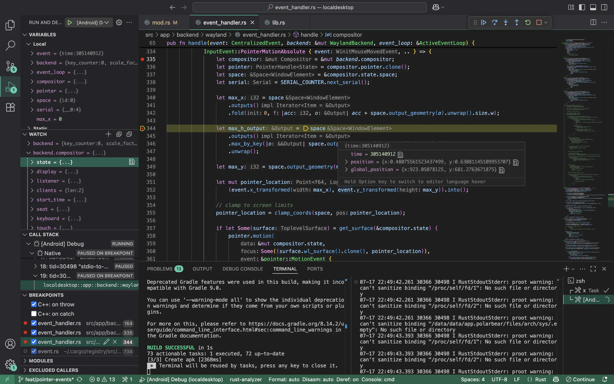

# Local Desktop

Local Desktop helps you run a desktop Linux environment on your Android device.

> Local Desktop is a Rust rewrite of the original [Polar Bear](https://github.com/localdesktop/polar-bear) project, which was written in Kotlin and C++. The aim of this rewrite is to make it more stable, portable, and able to do the development work on Android.

## How it works

1. An Arch Linux ARM64 filesystem is set up inside the app's internal storage.
2. Proot mounts the filesystem and provides a chroot-like environment.
3. A minimal built-in Wayland compositor runs in Android NDK.
4. Rootful Xwayland & a desktop environment launches inside the chroot and renders back to the Android native activity.


_Proof of Concept: A Pixel Tablet running the XFCE desktop environment inside a Proot-based ARM64 Linux. No configuration is required; just install and go._

## Getting Started

### How to build an APK

```bash
cargo install xbuild
x build --platform android --arch arm64
```

Alternatively, trigger the default build task by pressing `Ctrl+Shift+B`.

### How to develop

Recommended setup:

- **IDE**: Visual Studio Code

- **Extensions**:

  - [Rust Analyzer](https://marketplace.visualstudio.com/items?itemName=rust-lang.rust-analyzer)
  - [Android Debug](https://marketplace.visualstudio.com/items?itemName=nisargjhaveri.android-debug)
  - [CodeLLDB](https://marketplace.visualstudio.com/items?itemName=vadimcn.vscode-lldb)

- **Instructions**:

  1. Open Visual Studio Code.
  2. Launch the `[Android] Debug` configuration from the debug panel. This will:
     - Build the Rust code into an APK.
     - Install the APK on a selectable device, and launch the app in debug mode.
     - Redirect stdout/stderr output to the terminal.



> **Tip**: You can debug the app on either a physical device or a virtual device.

For more instructions on how to work on this project, please visit the [Developer Manual](https://localdesktop.github.io/docs/developer/how-it-works).
