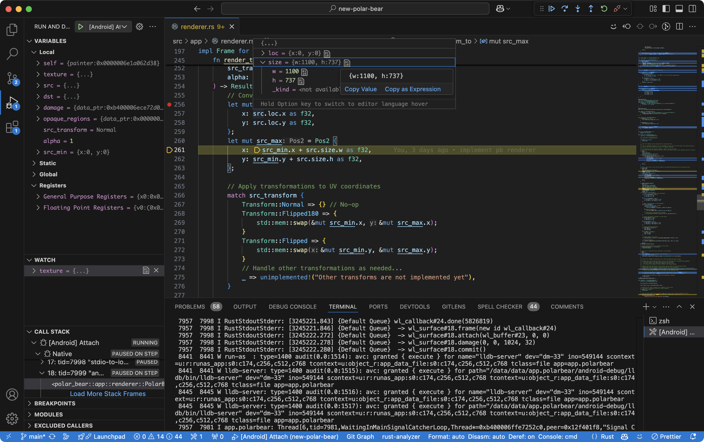

# New Polar Bear

Polar Bear helps you run a desktop Linux environment on your Android device.

> This is a Rust rewrite of the original [Polar Bear](https://github.com/polar-bear-app/polar-bear-app) project, which was written in Kotlin and C++. The aim of this rewrite is to make it more stable, portable, and able to do the development work on Android.

## Getting Started

### How to build an APK

```bash
cargo install xbuild
x build --platform android --arch arm64
```

Alternatively, trigger the default build task by pressing `Ctrl+Shift+B`.

### How to develop

Recommended setup:

- **IDE**: Visual Studio Code

- **Extensions**:

  - [Rust Analyzer](https://marketplace.visualstudio.com/items?itemName=rust-lang.rust-analyzer)
  - [Android Debug](https://marketplace.visualstudio.com/items?itemName=nisargjhaveri.android-debug)
  - [CodeLLDB](https://marketplace.visualstudio.com/items?itemName=vadimcn.vscode-lldb)

    > **Note**: CodeLLDB v1.11.2 has a bug when launching with Android Debug ([issue link](https://github.com/vadimcn/codelldb/issues/1220)). Please downgrade to v1.11.1 via Extensions tab > CodeLLDB > Install Specific Version... > v1.11.1 to work around the issue.

- **Instructions**:

  1. Open Visual Studio Code.
  2. Launch the `[Android] Debug` configuration from the debug panel. This will:
     - Build the Rust code into an APK.
     - Install the APK on a selectable device, and launch the app in debug mode.
     - Redirect stdout/stderr output to the terminal.



> **Tip**: You can debug the app on either a physical device or a virtual device.
